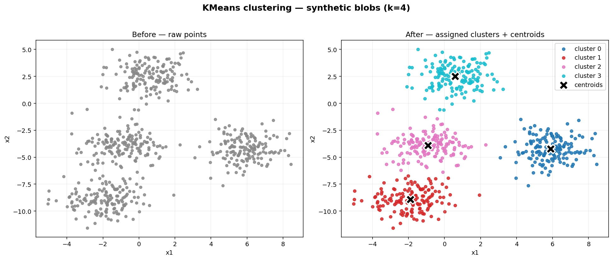

<div align="center">

# KMeans

**A from-scratch implementation of the K-Means clustering algorithm in Python.**

[](https://www.python.org/downloads/)
[](https://numpy.org/)
[](https://matplotlib.org/)

</div>

---

A small, readable implementation of **K-Means clustering** built only with NumPy — no scikit-learn for the algorithm itself. Useful for learning how the algorithm works under the hood: random centroid initialization, assignment step, update step, and the convergence check.

## Demo

Running `demo.py` clusters 600 synthetic points into **4 groups** and saves a side-by-side plot:



- **Left:** raw 2D points (no labels).
- **Right:** points colored by their assigned cluster, with centroids marked as black ✕.

## Quickstart

```bash
git clone https://github.com/RayverAimar/k-means.git
cd k-means

python3 -m venv .venv
source .venv/bin/activate
pip install -r requirements.txt

python demo.py            # generates kmeans_demo.png
```

> `scikit-learn` is only used to generate the synthetic dataset (`make_blobs`). The clustering itself runs on the implementation in `kmeans.py`.

## Usage

```python
import numpy as np
from sklearn.datasets import make_blobs
from kmeans import KMeans

X, _ = make_blobs(n_samples=500, centers=4, n_features=2, random_state=40)

model = KMeans(K=4, max_iters=150, plot_steps=False)
labels = model.predict(X)

print(model.centroids)   # final centroid coordinates
print(labels[:10])       # cluster index for each sample
```

## How it works

1. **Initialize** — pick `K` random samples as the starting centroids.
2. **Assign** — each point is assigned to the nearest centroid (Euclidean distance).
3. **Update** — each centroid moves to the mean of the points assigned to it.
4. **Repeat** — steps 2–3 until centroids stop moving (or `max_iters` is reached).

| Parameter | Description | Default |
|-----------|-------------|---------|
| `K` | Number of clusters | `5` |
| `max_iters` | Maximum number of iterations | `100` |
| `tol` | Convergence tolerance — stop when total centroid movement is below this | `1e-6` |
| `random_state` | Seed for reproducible centroid initialization | `None` |
| `plot_steps` | Plot the clusters at every iteration (interactive) | `False` |

## Project structure

```
k-means/
├── kmeans.py          # KMeans class — core algorithm
├── demo.py            # Synthetic-data demo that saves kmeans_demo.png
├── kmeans_demo.png    # Output of demo.py (committed for the README)
├── requirements.txt
└── README.md
```

## Notes

This project is intended for **educational purposes** — it is not optimized for production workloads. For real use cases, prefer [`sklearn.cluster.KMeans`](https://scikit-learn.org/stable/modules/generated/sklearn.cluster.KMeans.html), which adds k-means++ initialization, multiple restarts, and Cython-backed performance.
